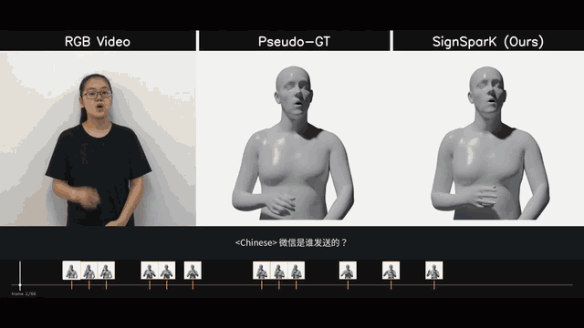
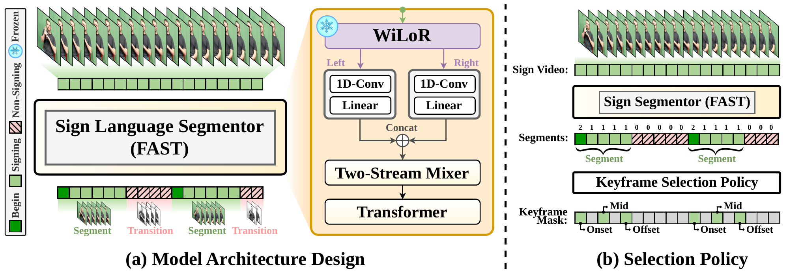

<div align="center">

# SignSparK: Efficient Multilingual Sign Language Production via Sparse Keyframe Learning

**[Jianhe Low](mailto:jianhe.low@surrey.ac.uk), Alexandre Symeonidis-Herzig, Maksym Ivashechkin, Özge Mercanoğlu Sincan, Richard Bowden**

Centre for Vision, Speech and Signal Processing (CVSSP), University of Surrey

**ECCV 2026**

[](https://arxiv.org/abs/2603.10446)
[](https://cogvis-cvssp.github.io/papers/signspark/)



*Full-resolution video on the [project page](https://cogvis-cvssp.github.io/papers/signspark/).*

</div>

---

## Overview

**SignSparK** is a Conditional Flow Matching framework for **multilingual Sign
Language Production (SLP)**. Instead of regressing dense pose sequences — which
collapses toward the mean and yields under-articulated signing — SignSparK
learns from **sparse keyframes** that capture the underlying kinematic
distribution of human signing, then synthesises fluid 3D signing sequences
conditioned on spoken-language text and those keyframes (Keyframe-to-Pose
generation). The framework supports four sign languages and achieves
state-of-the-art results across multiple benchmarks.

This repository contains the **flow-matching training and sampling code**. The
model is trained per body stream — **hand**, **body**, and **face** — which are
combined to produce the full signer.

> 📄 Paper: https://arxiv.org/abs/2603.10446 &nbsp;·&nbsp; 🌐 Project page: https://cogvis-cvssp.github.io/papers/signspark/

### Coming soon

- [ ] Back-translation evaluation weights.

## Installation

Python 3.10, PyTorch 2.10 with **CUDA 12.8** (required for Blackwell / RTX
50-series GPUs; works on older GPUs too):

```bash
conda env create -f environment.yml
conda activate signspark
```

Or with pip into your own environment:

```bash
pip install -r requirements.txt
```

> Both pull PyTorch from the `cu128` wheel index. For a different CUDA version,
> change the index URL (e.g. `.../whl/cu121`) and drop the `+cu128` tags in
> `environment.yml` / `requirements.txt`. Do **not** upgrade `huggingface_hub`
> past `<1.0` — `transformers 4.56.1` requires it.

## Data & checkpoints

SignSparK reads pose data from **LMDB** databases. We release prebuilt LMDBs for
**CSL-Daily** and **How2Sign** (6D pose features + translations + glosses +
segment annotations) — no local build step required:

```bash
python tools/download_data.py --datasets CSL-Daily How2Sign --dest ./data
export DATA_ROOT=$(pwd)/data
python tools/inspect_lmdb.py ${DATA_ROOT}/lmdb/train/CSL-Daily_reopt_train.lmdb  # sanity-check
```

Pretrained checkpoints (per stream) download into `$SIGNSPARK_CKPT_DIR`:

```bash
python tools/download_models.py --streams hand body face --dest ./checkpoints
export SIGNSPARK_CKPT_DIR=$(pwd)/checkpoints   # -> <stream>/ema_0.9999_<iter>.pt
```

See **[DATA.md](DATA.md)** for the record schema, directory layout, segment
labels, and the left-hand convention. Datasets and checkpoints live on the Hub:

> 🤗 Data: [LionelLow/SignSparK_data](https://huggingface.co/datasets/LionelLow/SignSparK_data) · Models: [LionelLow/SignSparK](https://huggingface.co/LionelLow/SignSparK)

Configure paths via environment variables (copy `.env.example` → `.env`):

| Variable | Meaning | Default |
| --- | --- | --- |
| `DATA_ROOT` | root holding `lmdb/<split>/*.lmdb` (downloaded data) | `./data` |
| `SIGNSPARK_CKPT_DIR` | released checkpoints, `{hand,body,face}/ema_*.pt` (read for sampling) | `./checkpoints` |
| `OUTPUT_DIR` | where **training** writes its runs/checkpoints | `./outputs` |

`OUTPUT_DIR` (training output) and `SIGNSPARK_CKPT_DIR` (released weights for
sampling) are deliberately separate — to sample your own freshly-trained model,
point `eval.model_path=` at the file under `OUTPUT_DIR`.

## FAST keyframe segmentation

**FAST**, the temporal sign language segmentor behind SignSparK's sparse
keyframes, labels every frame `0` (non-sign), `2` (sign onset) or `1`
(continuation), following the `segment` field of the LMDB schema.

<div align="center">
  
</div>

FAST is currently deployed as an internal toolkit and is under embargo until the
end of September 2026. The public release, along with the scripts that wire it
to SignSparK, will follow here. The currently released LMDBs already carry the `segment`
field, so the repo currently still works without the toolkit.

## Training

Configs are managed with [Hydra](https://hydra.cc/); select the body stream with
`data_v2=<hand|body|face|full>` and override any key on the CLI.

```bash
# Single GPU
python train.py data_v2=hand

# Multi-GPU (via 🤗 Accelerate)
accelerate launch train.py data_v2=hand
```

Train each stream separately (`hand`, `body`, `face`). Checkpoints (including EMA
weights) are written under `${OUTPUT_DIR}`. Common overrides:

```bash
python train.py data_v2=body batch_size=128 learning_steps=500000 \
                train_data='[CSL-Daily]' base_path=${DATA_ROOT}/lmdb
```

Logging is **opt-in**: metrics go to Weights & Biases only if you set
`WANDB_MODE=online` (and `WANDB_PROJECT` / `WANDB_ENTITY`); otherwise it runs
disabled.

## Sampling

Generate poses for a single stream using the inference config and a checkpoint:

```bash
python sample.py data_v2=hand data_v2/common@common=inference \
                 eval.model_path=${SIGNSPARK_CKPT_DIR}/hand/ema_0.9999_200000.pt \
                 eval.split=test eval.ode_stepnum=50
```

Or sample all three streams sequentially with `sample_all.py` (edit its `CONFIG`
dict, or pass the same overrides on the CLI — CLI wins):

```bash
python sample_all.py eval.note=CSLDaily eval.ode_stepnum=50 test_data='[CSL-Daily]'
```

Key sampling options (`eval.*`, set in the inference config or overridden):

| Option | Meaning |
| --- | --- |
| `eval.split` | which split to sample: `test` / `dev` / `train` |
| `test_data` (or `dev_data`/`train_data`) | **which dataset** for that split, e.g. `'[CSL-Daily]'` or `'[How2Sign]'` — the eval set is chosen by this list in `split.yaml`, *not* a `dataset=` arg |
| `eval.ode_stepnum` | number of ODE sampling steps |
| `eval.candidate_num` | samples drawn per clip |
| `eval.max_samples` | cap clips sampled (`-1` = whole split) |
| `eval.model_path` | checkpoint to load (per-stream) |
| `flip_left_hand` | flip left hand to right-hand frame if your LMDB stores SMPLX-left (see [DATA.md](DATA.md#hand-convention-flip_left_hand)) |

`sample_all.py` resolves per-stream checkpoints from
`${SIGNSPARK_CKPT_DIR}/<stream>/ema_0.9999_<iter>.pt` and runs the streams one at
a time to keep peak VRAM at a single stream's footprint.

**Classifier-free guidance / text-free sampling.** Set `eval.text_guidance_scale`
above `0` to apply text guidance (uses [`classifier_free.py`](classifier_free.py)).
For fully unconditional (no keyframe) sampling, set `eval.keyframes_mask_all=True`.
With `eval.text_guidance_scale=-1` guidance is off.

Outputs are written as `.npy` dictionaries containing predicted poses, lengths,
keyframe masks, conditioning text, and ground-truth poses.

## Visualization

[`tools/visualize.py`](tools/visualize.py) turns the sampled `.npy` files into
side-by-side (ground truth vs prediction) **SMPL-X mesh videos**:

```bash
python tools/visualize.py --body body_eval.npy --hand hand_eval.npy \
                          --face face_eval.npy --model-folder ${SMPLX_DIR} \
                          --out outputs/viz
```

It uses the official [`smplx`](https://github.com/vchoutas/smplx) package; you
must download the (license-gated) SMPL-X model files yourself. See
**[VISUALIZATION.md](VISUALIZATION.md)** for setup and options.

**Metrics.** For the quantitative evaluation protocol (MPJPE / PA-MPJPE / DTW),
use the official evaluation code at
[github.com/2000ZRL/SOKE](https://github.com/2000ZRL/SOKE).

## Citation

If you find this work useful, please cite:

```bibtex
@inproceedings{low2026signspark,
  title     = {SignSparK: Efficient Multilingual Sign Language Production via Sparse Keyframe Learning},
  author    = {Low, Jianhe and Symeonidis-Herzig, Alexandre and Ivashechkin, Maksym and Sincan, {\"O}zge Mercano{\u{g}}lu and Bowden, Richard},
  booktitle = {European Conference on Computer Vision (ECCV)},
  year      = {2026}
}
```

## Acknowledgements

The flow-matching training scaffold builds on
ideas from [FlowSeq](https://github.com/dongzhuoyao/flowseq), while evaluation metrics come from [SOKE](https://github.com/2000ZRL/SOKE). We sincerely thank the authors for open-sourcing their codebases.

## License

The **code** in this repository is released under the [Apache License 2.0](LICENSE).

The released **datasets and model checkpoints** are derived from CSL-Daily,
How2Sign and BOBSL and are provided for **non-commercial research use only**,
under the terms of those source datasets — not under Apache 2.0.
